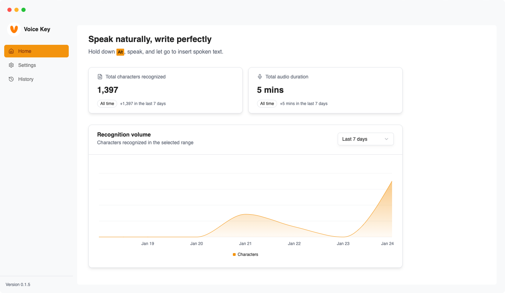
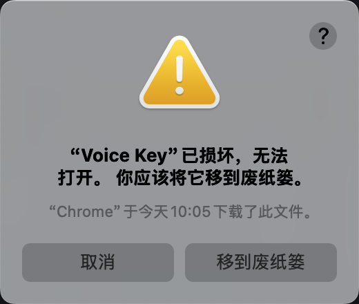
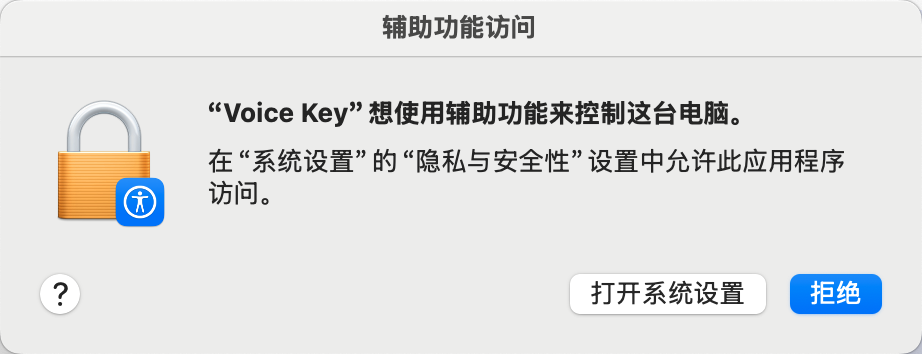
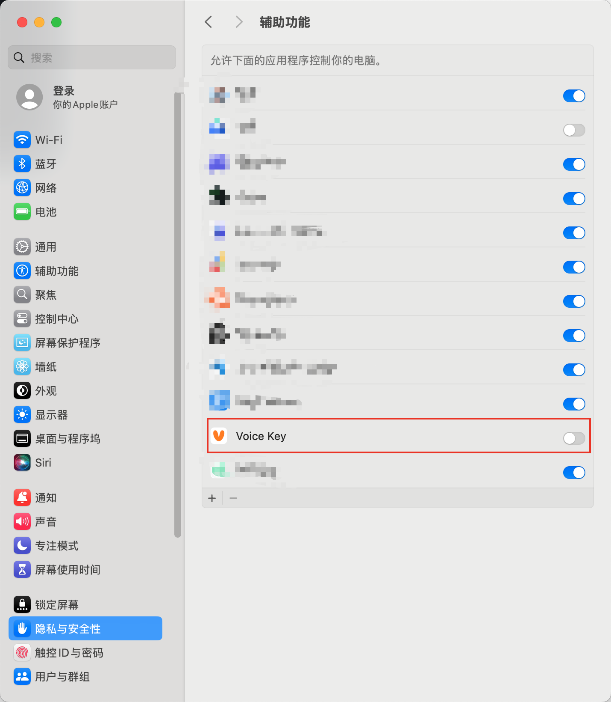

<a id="readme-top"></a>

[![Contributors][contributors-shield]][contributors-url]
[![Forks][forks-shield]][forks-url]
[![Stargazers][stars-shield]][stars-url]
[![Issues][issues-shield]][issues-url]

[English](./README_EN.md)

<br />
<div align="center">
  <a href="https://github.com/BuildWithAIs/voicekey">
    
  </a>

  <h3 align="center">Voice Key</h3>

  <p align="center">
    一款开源的桌面语音输入应用
    <br />
    <br />
    <a href="https://github.com/BuildWithAIs/voicekey">查看演示</a>
    &middot;
    <a href="https://github.com/BuildWithAIs/voicekey/issues">报告 Bug</a>
    &middot;
    <a href="https://github.com/BuildWithAIs/voicekey/issues">请求功能</a>
  </p>
</div>

<p align="center">
  
</p>

<details>
  <summary>目录</summary>
  <ol>
    <li>
      <a href="#about-the-project">主要功能</a>
      <ul>
        <li><a href="#built-with">技术栈</a></li>
      </ul>
    </li>
    <li>
      <a href="#getting-started">上手指南</a>
      <ul>
        <li><a href="#env-prerequisites">环境要求</a></li>
        <li><a href="#dev-installation">安装步骤</a></li>
      </ul>
    </li>
    <li><a href="#prerequisites">配置要求</a></li>
    <li><a href="#installation">macOS 安装指南</a></li>
    <li><a href="#license">开源协议</a></li>
    <li><a href="#roadmap">Star History</a></li>
  </ol>
</details>

## 主要功能 <a id="about-the-project"></a>

- **本地语音转写**: 使用 SenseVoiceSmall int8 在设备上离线识别，音频无需上传。
- **文本润色**: 支持基于 OpenAI-compatible 接口的轻量后处理。
- **文本注入**: 转写完成后可直接注入到当前焦点输入框。
- **桌面工作流**: 提供全局快捷键、HUD、日志和更新检查能力。

### 技术栈 <a id="built-with"></a>

- [![Electron][Electron.js]][Electron-url]
- [![React][React.js]][React-url]
- [![Vite][Vite.js]][Vite-url]
- [![TypeScript][TypeScript]][TypeScript-url]
- [![TailwindCSS][TailwindCSS]][TailwindCSS-url]
- [![shadcn/ui][shadcn/ui]][shadcn-url]
- [![Zustand][Zustand]][Zustand-url]

<p align="right">(<a href="#readme-top">back to top</a>)</p>

## 上手指南 <a id="getting-started"></a>

按照以下步骤在本地启动项目。

### 环境要求 <a id="env-prerequisites"></a>

- Node.js
- npm

```sh
npm install npm@latest -g
```

### 安装步骤 <a id="dev-installation"></a>

1. 克隆仓库。

```sh
git clone https://github.com/BuildWithAIs/voicekey.git
```

2. 安装依赖。

```sh
npm install
```

3. 启动开发环境。

```sh
npm run dev
```

4. 在设置页下载本地语音识别模型。

<p align="right">(<a href="#readme-top">back to top</a>)</p>

## 配置要求 <a id="prerequisites"></a>

语音识别仅使用本地 **SenseVoiceSmall int8** 模型，不需要 ASR API Key。首次使用前请在设置页下载约 240 MB 的模型文件；下载完成后，录音和识别均在本机进行。

## macOS 安装指南 <a id="installation"></a>

由于应用当前未签名，安装后可能需要额外执行以下步骤。

1. **解除安全限制**

   如果打开应用时提示“文件已损坏”，请在终端运行：

   ```bash
   xattr -cr /Applications/Voice\ Key.app
   ```

   

2. **授予辅助功能权限**

   应用需要监听按键并模拟输入。请前往 **系统设置 > 隐私与安全性 > 辅助功能**，为 **Voice Key** 打开权限。

   
   

## 开源协议 <a id="license"></a>

本项目采用 [Elastic License 2.0](LICENSE)。

## Star History <a id="roadmap"></a>

[](https://star-history.com/#BuildWithAIs/voicekey&Date)

<p align="right">(<a href="#readme-top">back to top</a>)</p>

[contributors-shield]: https://img.shields.io/github/contributors/BuildWithAIs/voicekey.svg?style=for-the-badge
[contributors-url]: https://github.com/BuildWithAIs/voicekey/graphs/contributors
[forks-shield]: https://img.shields.io/github/forks/BuildWithAIs/voicekey.svg?style=for-the-badge
[forks-url]: https://github.com/BuildWithAIs/voicekey/network/members
[stars-shield]: https://img.shields.io/github/stars/BuildWithAIs/voicekey.svg?style=for-the-badge
[stars-url]: https://github.com/BuildWithAIs/voicekey/stargazers
[issues-shield]: https://img.shields.io/github/issues/BuildWithAIs/voicekey.svg?style=for-the-badge
[issues-url]: https://github.com/BuildWithAIs/voicekey/issues
[license-shield]: https://img.shields.io/github/license/BuildWithAIs/voicekey.svg?style=for-the-badge
[license-url]: https://github.com/BuildWithAIs/voicekey/blob/master/LICENSE
[Electron.js]: https://img.shields.io/badge/Electron-191970?style=for-the-badge&logo=Electron&logoColor=white
[Electron-url]: https://www.electronjs.org/
[React.js]: https://img.shields.io/badge/React-20232A?style=for-the-badge&logo=react&logoColor=61DAFB
[React-url]: https://reactjs.org/
[Vite.js]: https://img.shields.io/badge/vite-%23646CFF.svg?style=for-the-badge&logo=vite&logoColor=white
[Vite-url]: https://vitejs.dev/
[TypeScript]: https://img.shields.io/badge/typescript-%23007ACC.svg?style=for-the-badge&logo=typescript&logoColor=white
[TypeScript-url]: https://www.typescriptlang.org/
[TailwindCSS]: https://img.shields.io/badge/tailwindcss-%2338B2AC.svg?style=for-the-badge&logo=tailwind-css&logoColor=white
[TailwindCSS-url]: https://tailwindcss.com/
[shadcn/ui]: https://img.shields.io/badge/shadcn%2Fui-000000?style=for-the-badge&logo=shadcnui&logoColor=white
[shadcn-url]: https://ui.shadcn.com/
[Zustand]: https://img.shields.io/badge/zustand-%2320232a.svg?style=for-the-badge&logo=react&logoColor=%2361DAFB
[Zustand-url]: https://github.com/pmndrs/zustand
